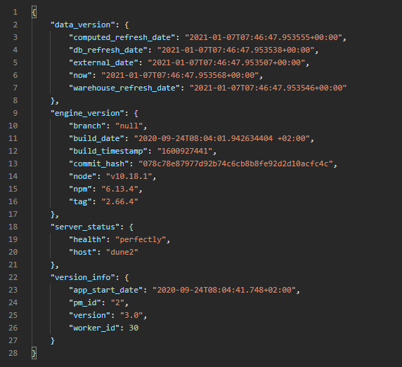
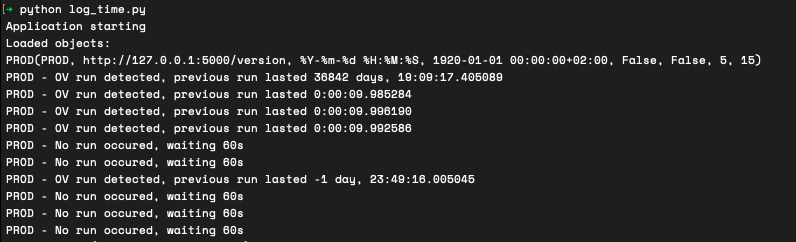

Server Status Check
============ 
[](https://github.com/psf/black)&nbsp;

<br/>
My first application created to monitor status of external application via GET request. Example of server 
response is saved to<br/>



<br/>

To simulate application working it is possible to start mock server `./mock_server/mock_server.py` which will generate needed responses.



Main functions</br>
===============
Main function of application is to constantly check when last time data on external application were updated which is represented in change date/time filed in `computed_time`. 
After each change depending on confguration fille application will print sufficent mesage to termina,log file, save time diff to database or send notification via RocketChat.

Example configuration file:
```
servers:                                    # list of servers
  PROD:   
    name: PROD                              # name of server after which object will be named 
    adress: http://127.0.0.1:5000/version   # adress
    db_save: false                          # specify if time diff need to be saved to datbase
    notification: false                     # specify if notification via RocetChat need to send 
                                                after crossing treshold time without update
    notification_treshold: 15               # threshold time after which notification will be sent. 
    msg_interval: 5                         # time interval of repeating message (in minutes)
credentials:
  DB:
    engine: mysql+mysqlconnector            # engine used to create connetion using SqlAlchemy
    username: database_user                 # user
    password: database_password             # password
    adress: 127.0.0.1:3306                  # adress
    db: example_database                    # database name
    table: example_table                    # table name
  ROCKETCHAT:                               #RocketChat channel webhook
    webhook: https://rock.sever.example/hooks/random/random
    headers: { "content-type": "application/json" }
logs:                                       #logs settings
  filename: runs.log
  filemode: a
  level: logging.INFO
main:                                       #Time interval of server checkups (in seconds)
  checkup_interval: 60                         application will check status of servers every 60 seconds
```

I know that many things could be imporved however,as application is no longer needed I won't be developing it any further.

